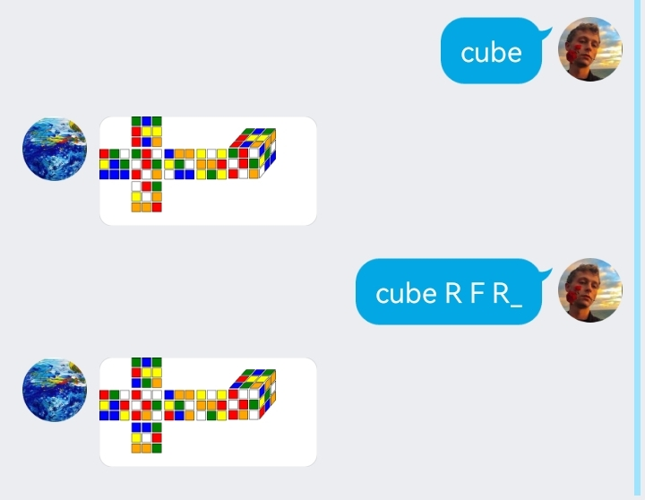
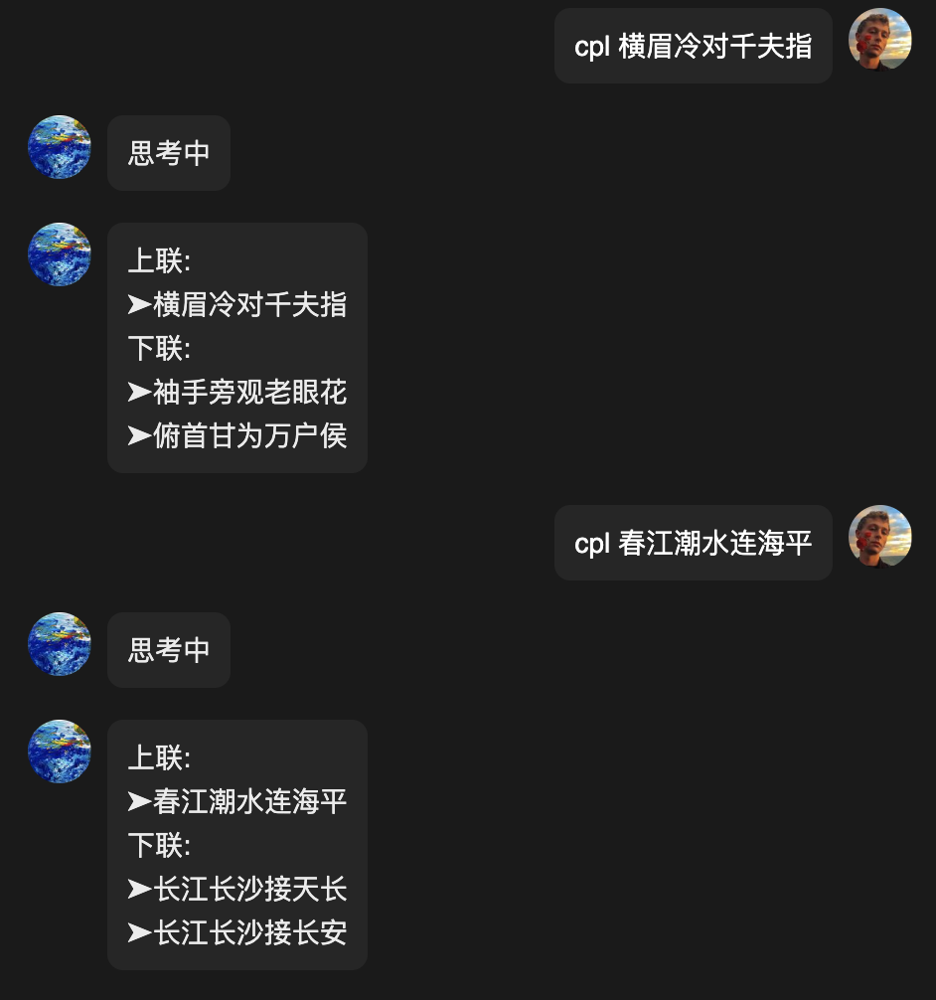

# koishi插件集

一些自己写的koishi插件

QQ群399899914

[作者b站](https://space.bilibili.com/225995995)

* 扫雷工具箱 --[stnb](stnb)

* 颜值评分 --[facercg](https://github.com/initialencounter/koishi-plugin-facercg)

* AI绘图 --[sd-taylor](https://github.com/initialencounter/koishi-plugin-sd-taylor)

* 数字华容道 --[puzzle](puzzle)

* 魔方 --[cube](cube)

* 黑名单 --[blacklist](blacklist)

* steam挂刀行情 --[steam-trading](steam-trading)

* 扫雷联萌排行榜 --[mswar-acyive-rank](smwar-rank)

对对子 --[couplet](couplet)
## 扫雷工具箱 --[stnb](stnb)
### 描述
计算扫雷游戏的参数
### 使用用法
stnb 60 3 3
第一个参数60代表扫雷的时间单位是秒
第二个参数3代表扫雷的3bv/s单位是1
第三个参数3代表扫雷的模式，可用选项为［1:初级,2:中级,3:高级]
### 示例

## 达芬奇3语言模型 --[davinci-003](davinci-003)
### 描述
OpenAI的聊天插件
### 使用用法
dvc 你好

## 颜值评分 --[facercg](https://github.com/initialencounter/koishi-plugin-facercg)
### 描述
预测图片中人脸的颜值，调用自百度智能云
### 使用用法
face <含有人脸的图片>

### 示例
### 效果展示

### 多人识别

## 自动回复 --[auto-reply](auto-reply)

### 描述
设置自动回复的词库
### 使用用法
ar <触发词>#<回复词>

### 示例

## AI绘图 --[sd-taylor](https://github.com/initialencounter/koishi-plugin-sd-taylor)

### 描述
调用stable diffusion的API，需要自建服务器

### 使用用法
#### 文字绘图
tl <描述词>
#### 以图绘图
tl <描述词> <图片>
#### 识图
tl <图片>
#### 图片转超分辨率
tl  -u 1 <图片>

本插件抄自novelai和rryth，感谢此二插件作者的包容

## 感谢
[novelai-bot](https://github.com/koishijs/novelai-bot)
[MirrorCY-rryth](https://github.com/MirrorCY/rryth)(直接抄）
### 示例
#### txt2img 文字绘图

#### img2img 以图绘图

#### interrogate 识图

#### extra-single-image 超分辨率

## 数字华容道 --[puzzle](puzzle)

### 描述
数字华容道游戏，原游戏
[nonebot-plugin-puzzle](https://github.com/initialencounter/nonebot-plugin-puzzle)重写版
### 使用用法
启动游戏：pz
游戏帮助
在方形区域内移动方块，将所有方块从左到右、从上到下按、从小到大的顺序排列，通过![alt u:上,d:下,l:左,r:右]命令移动黑色方块。

### 示例

## 魔方 --[cube](cube)

### 描述
三阶魔方
[nonebot-plugin-cube](https://github.com/initialencounter/nonebot-plugin-cube)重写版
### 使用用法
cube <方向命令>
方向命令:![alt f,b,u,d,l,r,f_,b_,u_,d_,l_,r_]前后上下左右的英文首字母，不区分大小写，无下划线代表顺时针旋转，有下划线代表逆时针旋转。

### 示例

## 黑名单 --[blacklist](blacklist)

### 描述
拉黑发送带有违禁词命令的用户
### 使用用法
在配置项中添加违禁词，用英文逗号间隔开
### 示例

## steam挂刀行情 --[steam-trading](steam-trading)

### 描述
获取steam虚拟商品交易平台信息
### 使用用法
trad
### 示例

## 扫雷联萌排行榜 --[mswar-acyive-rank](smwar-rank)

### 描述
使用获取扫雷联萌app中的排名
### 使用用法
ms-ac
### 示例

## 对对子 --[couplet](https://github.com/initialencounter/mykoishi/couplet)

### 描述
seq2seq-couplet-model对对联
### 使用用法
cpl <对子>
### 示例

