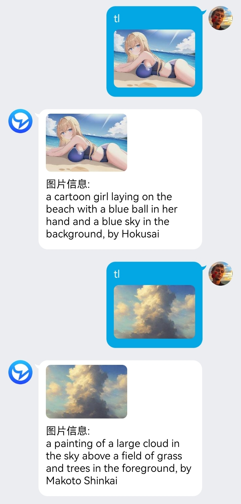
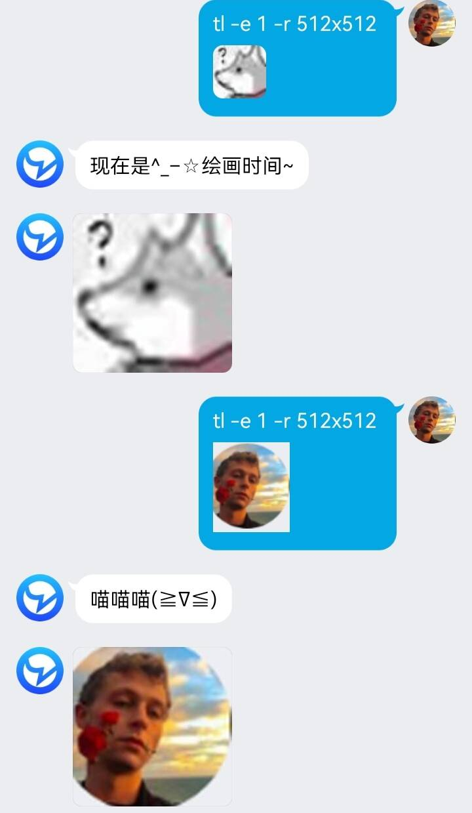
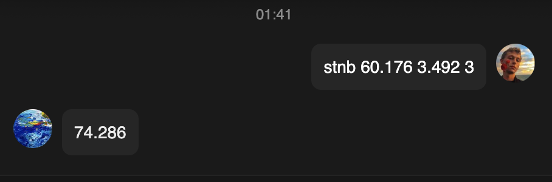

<!-- PROJECT LOGO -->
 

  <a href="https://github.com/initialencounter/mykoishi">
    
  </a>

<h3 align="center">koishi插件集</h3>

  

    一些自己写的koishi插件
     
    <a href="https://github.com/initialencounter/mykoishi"><strong>Explore the docs »</strong></a>
     
     
    <a href="https://github.com/initialencounter/mykoishi">View Demo</a>
    ·
    <a href="https://github.com/initialencounter/mykoishi/issues">Report Bug</a>
    ·
    <a href="https://github.com/initialencounter/mykoishi/issues">Request Feature</a>
  

* mqtt消息订阅与发布 --[mqtt](https://github.com/initialencounter/mykoishi/tree/master/mqtt)

* 意间AI绘画 --[arcadia](https://github.com/initialencounter/mykoishi/tree/master/arcadia)

* 颜值评分 --[facercg](https://github.com/initialencounter/koishi-plugin-facercg)

* AI聊天 --[davinci-003](https://github.com/initialencounter/mykoishi/tree/master/davinci-003) 

* AI绘图 --[sd-taylor](https://github.com/initialencounter/koishi-plugin-sd-taylor) 

* 数字华容道 --[puzzle](https://github.com/initialencounter/mykoishi/tree/master/puzzle) 

* 魔方 --[cube](https://github.com/initialencounter/mykoishi/tree/master/cube) 

* 黑名单 --[blacklist](https://github.com/initialencounter/mykoishi/tree/master/blacklist) 

* steam挂刀行情 --[steam-trading](https://github.com/initialencounter/mykoishi/tree/master/steam-trading) 

* 对对子 --[couplet](https://github.com/initialencounter/mykoishi/tree/master/couplet)

* 老色批 --[lsp](https://github.com/initialencounter/mykoishi/tree/master/lsp) 

* 扫雷工具箱 --[stnb](https://github.com/initialencounter/mykoishi/tree/master/stnb) 

* ~~自动回复 --[auto-reply](https://github.com/initialencounter/mykoishi/tree/master/auto-reply) ~~
(有bug）

* ~~王者荣耀巅峰赛推送 --[hok-rank](https://github.com/initialencounter/mykoishi/tree/master/hok-rank) ~~
(不再维护）

* ~~扫雷联萌排行榜 --[mswar-active-rank](https://github.com/initialencounter/mykoishi/tree/master/smear_rank) ~~
(不再维护）

# 具体信息

(<a href="#readme-top">back to top</a>)

### 描述
mqtt订阅与发布
### 使用用法

(<a href="#readme-top">back to top</a>)

### 描述
意间AI的绘图插件
### 使用用法
arca -h

(<a href="#readme-top">back to top</a>)

## AI聊天 --[davinci-003](https://github.com/initialencounter/mykoishi/davinci-003)

### 描述
OpenAI的聊天插件
### 使用用法
dvc 你好

(<a href="#readme-top">back to top</a>)

## 颜值评分 --[facercg](https://github.com/initialencounter/koishi-plugin-facercg)

### 描述
预测图片中人脸的颜值，调用自百度智能云
### 使用用法
face <含有人脸的图片>

### 示例
### 效果展示

### 多人识别

(<a href="#readme-top">back to top</a>)

## AI绘图 --[sd-taylor](https://github.com/initialencounter/koishi-plugin-sd-taylor)

### 描述
调用stable diffusion的API，需要自建服务器

### 使用用法
#### 文字绘图
tl <描述词>
#### 以图绘图
tl <描述词> <图片>
#### 识图
tl <图片>
#### 图片转超分辨率
tl  -u 1 <图片>

本插件抄自novelai和rryth

## 感谢
[novelai-bot](https://github.com/koishijs/novelai-bot)
[MirrorCY-rryth](https://github.com/MirrorCY/rryth)(直接抄）
### 示例
#### txt2img 文字绘图

(<a href="#readme-top">back to top</a>)

#### img2img 以图绘图

(<a href="#readme-top">back to top</a>)

#### interrogate 识图

(<a href="#readme-top">back to top</a>)

#### extra-single-image 超分辨率

(<a href="#readme-top">back to top</a>)

## 数字华容道 --[puzzle](https://github.com/initialencounter/mykoishi/puzzle)

### 描述
数字华容道游戏，原游戏[扫雷联萌](http://tapsss.com)
[nonebot-plugin-puzzle](https://github.com/initialencounter/nonebot-plugin-puzzle)重写版
### 使用用法
启动游戏：pz
游戏帮助
在方形区域内移动方块，将所有方块从左到右、从上到下按、从小到大的顺序排列，通过![alt u:上,d:下,l:左,r:右]命令移动黑色方块。

### 示例

(<a href="#readme-top">back to top</a>)

## 魔方 --[cube](https://github.com/initialencounter/mykoishi/cube)

### 描述
三阶魔方
[nonebot-plugin-cube](https://github.com/initialencounter/nonebot-plugin-cube)重写版
### 使用方法
|  方法  | 命令  |
|  ----  | ----  |
| 开始游戏  | cb\|cube\|魔方 |

cube <方向命令>
方向命令:![alt f,b,u,d,l,r,f_,b_,u_,d_,l_,r_]前后上下左右的英文首字母，不区分大小写，无下划线代表顺时针旋转，有下划线代表逆时针旋转。

### 示例

(<a href="#readme-top">back to top</a>)

(<a href="#readme-top">back to top</a>)

(<a href="#readme-top">back to top</a>)

### 感谢
## cube.js参考b站--[神闪避的雪亲王](https://space.bilibili.com/16355723)

(<a href="#readme-top">back to top</a>)

## 黑名单 --[blacklist](https://github.com/initialencounter/mykoishi/blacklist)

### 描述
拉黑发送带有违禁词命令的用户
### 使用用法
在配置项中添加违禁词，用英文逗号间隔开
### 示例

(<a href="#readme-top">back to top</a>)

## steam挂刀行情 --[steam-trading](https://github.com/initialencounter/mykoishi/steam-trading)

### 描述
获取steam虚拟商品交易平台信息
### 使用用法
trad
### 示例

(<a href="#readme-top">back to top</a>)

## 对对子 --[couplet](couplet)

### 描述
seq2seq-couplet-model对对联
### 使用用法
cpl <对子>
### 示例

(<a href="#readme-top">back to top</a>)

## 扫雷工具箱 --[stnb](https://github.com/initialencounter/mykoishi/stnb)

### 描述
计算扫雷游戏的参数
### 使用用法
* stnb 60 3 3

* 第一个参数60代表扫雷的时间单位是秒

* 第二个参数3代表扫雷的3bv/s单位是1

* 第三个参数3代表扫雷的模式，可用选项为［1:初级,2:中级,3:高级]

### 示例

<!-- LICENSE -->
## License

Distributed under the MIT License. See `LICENSE.txt` for more information.

(<a href="#readme-top">back to top</a>)

<!-- CONTACT -->
## Contact

QQ群399899914

[bilibili](https://space.bilibili.com/225995995)

(<a href="#readme-top">back to top</a>)

<!-- ACKNOWLEDGMENTS -->
## Acknowledgments

* [koishi开发者们](https://koishi.chat/)
* [houko(小莫)](https://github.com/houko)
* [xhmily(呆呆木)](https://lucent.blog/)
* [inisis](https://github.com/inisis)

(<a href="#readme-top">back to top</a>)
